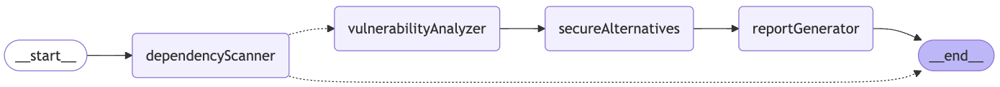
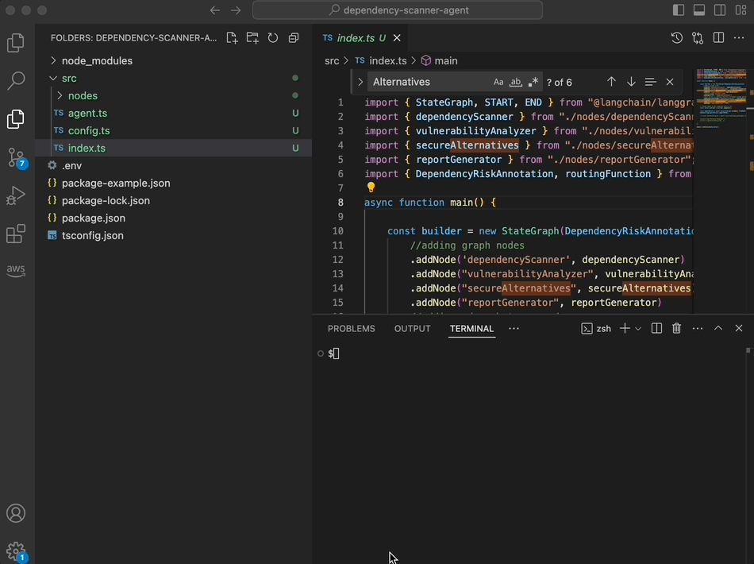

# Dependency scanner agent

Langgraph Multi-Agent for automating dependency risk management.



## Basic Requirements

1. Install Node.js [https://nodejs.org/en/download/](https://nodejs.org/en/download/)
2. Install `TypeScript`

```sh
npm install -g typescript
```

3. Install required dependencies

```sh
npm install
```

4. Get an Gemini API key: [https://makersuite.google.com/app/apikey](https://makersuite.google.com/app/apikey)
5. Get an OpenAI API key: [https://beta.openai.com/signup/](https://beta.openai.com/signup/)
6. Update your `.env` file with your API_KEY

## Build and Run

To start the server from the compiled folder (/dist).

```sh
npm run start
```

## Demo


